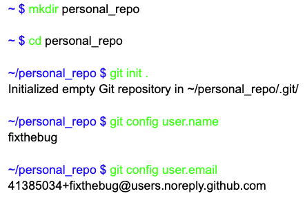

## What is it?

Each time you create or clone a Git repository, you need to configure the `user.name` and `user.email`  (and SSH for private repos).

I often forget to do this, and sometimes I don't remember my no-reply email address. Here's a solution.

With profile configurations, you can control the necessary settings for each workspace (directory).

## Git profile

Create a separate file with specific configurations for the profile. Here I create it at `~/.config/git/personal.config`. Do replace with yours.

```conf
[user]
  email = 41385034+fixthebug@users.noreply.github.com
  name = fixthebug
[core]
  sshCommand="ssh -i ~/.ssh/personal"
```

The sshCommand profile provides the SSH key for private repositories. You can use this in combination with [git ssh config](posts/configure-ssh-alias/) to pull and push code seamlessly.

## Setup profiles in .gitconfig

Append these lines at the end of your `~/.gitconfig`

```conf
[include]
 path = "~/.config/git/personal.config"
[includeIf "gitdir:~/work1/"]
 path = "~/.config/git/work1.config"
[includeIf "gitdir:~/work2/"]
 path = "~/.config/git/work2.config"
```

Explain:

- The first `include` tells Git to apply the personal profile for *every* path. This is considered the default profile.
- The `includeIf` directives tells git to apply the `work1.config` for every path under `~/work1/`, and `work2.config` for subfolders of `~/work2/`

## Conclusion

That's it! Now, each time you create or clone a new project. Git will automatically determine the correct profile for you! 😎



## Reference

- [multipleGitProfiles](https://gist.github.com/Icaruk/f024a18093dc28ec1588cfb90efc32f7)
- [toggling between work account / personal account](https://www.reddit.com/r/git/comments/195gg0h/comment/kjuscfl/)
